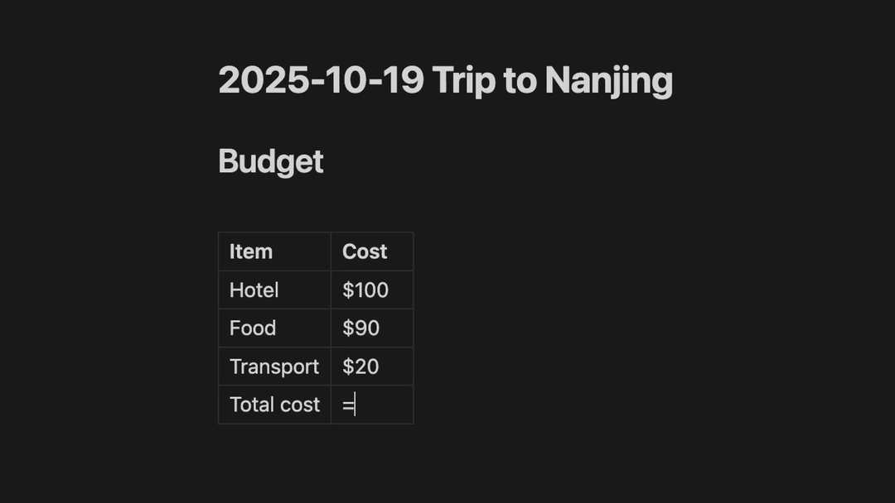

# Obsidian Table Math

Perform spreadsheet-like calculations directly in your markdown tables with live formulas, automatic recalculation, and cross-note references.



## Table of Contents
- [Features](#features)
- [Quick Start](#quick-start)
  - [Editing Mode](#editing-mode)
  - [Preview Mode](#preview-mode)
- [Formulas](#formulas)
  - [Basic Functions](#basic-functions)
  - [Data Modifier](#data-modifier)
  - [Arithmetic Expressions](#arithmetic-expressions)
  - [Complex Expressions](#complex-expressions)
- [Currency Support](#currency-support)
- [Cross-Note References](#cross-note-references)
- [Settings](#settings)
- [License](#license)

## Features

- 📊 **Table Formulas** - SUM, AVG, MIN, MAX in markdown tables
- ⚡ **Auto-Calculate** - Updates as you type
- 🔗 **Cross-Note References** - Pull values from other notes with currency inheritance
- 💰 **Currency Support** - Format results in USD, EUR, GBP, JPY, and 150+ currencies
- 🧮 **Arithmetic** - Full expression support (+, -, \*, /, parentheses)
- 🔒 **100% Offline** - All data stored locally

## Quick Start

### Editing Mode

Type formulas directly in your tables (you'll see the formula):

```markdown
| Destination | Days      | Highlights       |
| ----------- | --------- | ---------------- |
| Bangkok     | 3         | Grand Palace     |
| Singapore   | 2         | Marina Bay       |
| Tokyo       | 4         | Shibuya Crossing |
| Seoul       | 3         | Gyeongbokgung    |
| **Total**   | =SUM(col) |                  |
```

### Preview Mode

The formula automatically calculates and displays as bold:

| Destination | Days   | Highlights       |
| ----------- | ------ | ---------------- |
| Bangkok     | 3      | Grand Palace     |
| Singapore   | 2      | Marina Bay       |
| Tokyo       | 4      | Shibuya Crossing |
| Seoul       | 3      | Gyeongbokgung    |
| **Total**   | **12** |                  |

## Formulas

### Basic Functions

All formulas must specify `col` or `row`:

| Function | Column      | Row         | Description        |
| -------- | ----------- | ----------- | ------------------ |
| **SUM**  | `=SUM(col)` | `=SUM(row)` | Add all values     |
| **AVG**  | `=AVG(col)` | `=AVG(row)` | Calculate average  |
| **MIN**  | `=MIN(col)` | `=MIN(row)` | Find minimum value |
| **MAX**  | `=MAX(col)` | `=MAX(row)` | Find maximum value |

> **Note:** If a formula is invalid, the raw formula will be displayed.

### Data Modifier

Use the `data` modifier to exclude formula results from aggregate calculations:

```markdown
| Category | Amount         |
| -------- | -------------- |
| Revenue  | 1000           |
| Costs    | 400            |
| Profit   | =1000-400      |
| Total    | =SUM(col, data)|
| Average  | =AVG(col, data)|
```

The `data` modifier works with all aggregate functions:

| Function | Column Syntax | Row Syntax |
| -------- | ------------- | ---------- |
| **SUM**  | `=SUM(col, data)` | `=SUM(row, data)` |
| **AVG**  | `=AVG(col, data)` | `=AVG(row, data)` |
| **MIN**  | `=MIN(col, data)` | `=MIN(row, data)` |
| **MAX**  | `=MAX(col, data)` | `=MAX(row, data)` |

### Arithmetic Expressions

- `=10+20-5` - Basic math operations
- `=(10+5)*2` - Parentheses for grouping

### Complex Expressions

Combine functions with arithmetic operations:

- `=SUM(col)/2` - Divide sum by 2
- `=AVG(row)*1.15` - Add 15% markup
- `=MAX(col)-MIN(col)` - Calculate range
- `=(SUM(col)+SUM(row))/2` - Average of column and row sums
- `=SUM(col, USD)/2` - Currency formatting with complex expressions

## Currency Support

Add currency codes to format results automatically:

| Formula          | Result      |
| ---------------- | ----------- |
| `=SUM(col, USD)` | **$100.00** |
| `=AVG(row, EUR)` | **€50.00**  |
| `=MAX(col, GBP)` | **£200.00** |

```markdown
| Service       | Cost (EUR)     |
| ------------- | -------------- |
| Hotel Stay    | €120           |
| Dinner        | €45            |
| Museum Ticket | €15            |
| **Total**     | =SUM(col, EUR) |
```

**Supported currencies:** USD ($), EUR (€), GBP (£), JPY (¥), and 150+ more ISO 4217 codes

## Cross-Note References

**In "Trip Wuxi" note:**

```markdown
| Expense | Amount         |
| ------- | -------------- |
| Hotel   | $500           |
| Food    | $200           |
| Total   | =SUM(col, USD) |
```

**In "Summary" note:**

```markdown
| Trip  | Amount                    |
| ----- | ------------------------- |
| Wuxi  | =NOTE("Trip Wuxi").total  |
| Tokyo | =NOTE("Trip Tokyo").total |
| Total | =SUM(col)                 |
```

**Preview shows:**

- Trip Wuxi: **$700.00** (inherits USD currency)
- NOTE references automatically use the source note's currency

Variable names are automatically generated from the **first column** in each row by:

- Converting to lowercase
- Replacing spaces and special characters with underscores (`_`)

For example:

- `Total` becomes `total`
- `Total (USD)` becomes `total_usd`

## Settings

- **Precision** (0-10) - Decimal places (default: 2)
- **Locale** (e.g., en-US, de-DE) - Number formatting style

## License

This project is licensed under the [GNU General Public License v3.0](LICENSE).
